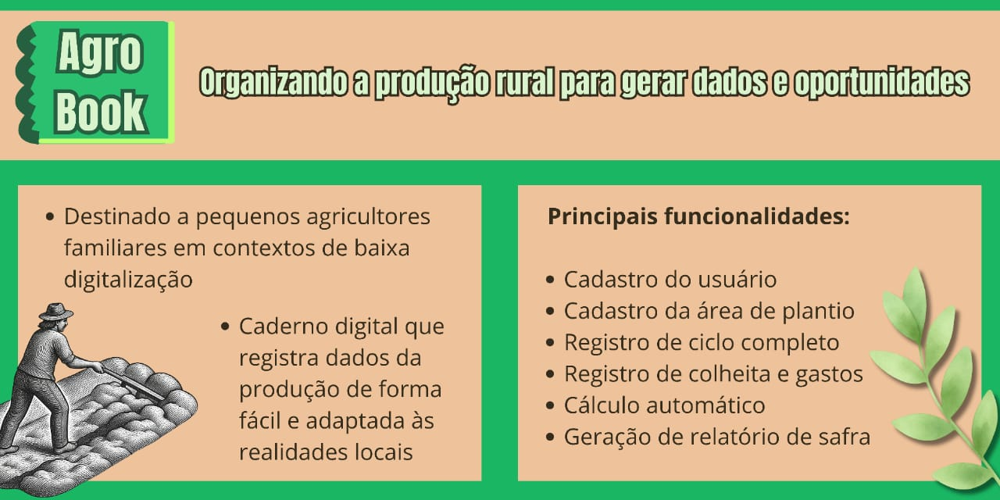

<div align="center">



<br/><br/>


```
------------------------------------------------------------------
|*************************** AGROBOOK ***************************|
|                                                                |
| Organizando a produção rural para gerar dados e oportunidades. |
|                                                                |
|****************************************************************|
------------------------------------------------------------------
```

</div>

---

## 📌 Sobre o projeto

O **AGROBOOK** é um caderno digital com interface gráfica desenvolvido para auxiliar agricultores no registro e organização da produção rural. O sistema permite cadastrar áreas de plantio, registrar plantios, colheitas e gastos, gerenciar coproprietários e herdeiros, e gerar um relatório completo da safra em HTML — tudo por meio de uma interface visual intuitiva, projetada no formato mobile (360×640 px).

Projeto desenvolvido para a disciplina **PISI1 — Projeto Interdisciplinar para Sistemas de Informação 1** da **UFRPE**, 2026.

---

## 👨‍💻 Desenvolvedores

| Nome | GitHub |
|------|--------|
| Gabriel Soares | [@GS-bit](https://github.com/GS-bit) |
| Pollyana Cassia | [@pollyanasousa](https://github.com/pollyanasousa) |

**Professor:** Cleyton Vanut

---

## 🚀 Como executar

### Pré-requisitos

- **Python 3.11** ou superior
- Gerenciador de pacotes `pip`

### Instalação das dependências externas

```bash
# Clone o repositório
git clone https://github.com/pollyanasousa/projeto-interdisciplinar-ufrpe.git

# Entre na pasta do projeto
cd projeto-interdisciplinar-ufrpe

# Instale as dependências
pip install PyQt6 twilio python-dotenv
```

### Configuração do SMS (Twilio)

O sistema envia um código de verificação por SMS no cadastro. Crie um arquivo `.env` na raiz do projeto com as credenciais da sua conta [Twilio](https://www.twilio.com):

```env
TWILIO_ACCOUNT_SID=ACxxxxxxxxxxxxxxxxxxxxxxxxxxxxxxxx
TWILIO_AUTH_TOKEN=xxxxxxxxxxxxxxxxxxxxxxxxxxxxxxxx
TWILIO_PHONE_NUMBER=+15XXXXXXXXXX
```

> **Modo de desenvolvimento:** se o `.env` não estiver configurado, o sistema funciona normalmente e imprime o código SMS no terminal, sem precisar de conta Twilio.

### Executando

```bash
python main.py
```

> A pasta `data/` e todos os arquivos JSON são criados automaticamente na primeira execução.

---

## 📄 Artigo Científico

O projeto é acompanhado de um artigo científico no formato SBC, documentando a proposta técnica e social do AgroBook Rural.

- **Overleaf (edição):** [AgroBook Rural — Artigo PISI1](https://www.overleaf.com/read/sdfmzgwfpyrt#537d19)
- **PDF:** disponível na pasta `doc/` do repositório

---

## 📦 Histórico de releases

### 🟢 v1.0 — Release 1 (VA1) · entregue em 29/04/2026

Primeira versão funcional do AgroBook. Toda a interação com o usuário era feita via **terminal (CLI)** — menus de texto, entrada por teclado, saída impressa no console. O sistema já estava estruturado em **Programação Orientada a Objetos**, com cada entidade em sua própria classe e persistência em arquivos JSON.

| Requisito | Descrição |
|-----------|-----------|
| RF001 | Cadastro do agricultor com validação matemática de CPF, telefone, cidade e estado |
| RF002 | Gerenciamento de áreas de plantio (CRUD completo) |
| RF003 | Registro de plantios (CRUD completo) |
| RF004 | Colheita e gastos (CRUD completo) |
| RF005 | Geração de relatório de safra em HTML |
| RF006 | Estruturação em POO com separação em camadas (model / utils) |

---

### 🟢 v2.0 — Release 2 (VA2) · entregue em 10/06/2026

Grande salto em relação à VA1: o terminal foi **completamente substituído por uma interface gráfica desktop** construída com PyQt6. O fluxo de cadastro ganhou autenticação por SMS, o sistema passou a entender a linguagem coloquial do agricultor para datas e medidas, e foi adicionado o módulo de multiproprietários e herdeiros.

| Requisito | Descrição |
|-----------|-----------|
| RF007 | Interface gráfica desktop com PyQt6 — 15 telas navegáveis via `QStackedWidget` |
| RF008 | Parser de linguagem natural: datas coloquiais e medidas agrícolas com conversão automática |
| RF009 | Cadastro de multiproprietários e herdeiros com vínculo e percentual de participação |
| RF010 | Autenticação por código SMS via Twilio no fluxo de cadastro |

---

### 🔵 v3.0 — Release 3 (VA3) · em desenvolvimento

| Requisito | Descrição | Status |
|-----------|-----------|--------|
| RF011 | Inserção de dados por voz | 🔄 A fazer |

---

## 🗂️ Estrutura do projeto

```
projeto-interdisciplinar-ufrpe/
│
├── main.py                    ← porta de entrada; inicializa os JSONs e sobe a janela Qt
├── .env                       ← credenciais Twilio (não versionar em produção)
│
├── gui/                       ← camada de apresentação (View + Controller)
│   ├── agrobook_window.py     ← janela principal; carrega as telas .ui e conecta os eventos
│   ├── events.py              ← controlador; toda lógica de resposta a cliques da UI
│   ├── dialog.py              ← diálogos reutilizáveis (erro, confirmação, formulários)
│   ├── *.ui                   ← 15 layouts XML criados no Qt Designer (uma tela por arquivo)
│   └── images/                ← ícones e logotipo do sistema
│
├── model/                     ← camada de dados (cada entidade lê e escreve seu próprio JSON)
│   ├── farmer.py              ← agricultor — entidade central que agrega todos os outros modelos
│   ├── area.py                ← áreas de plantio
│   ├── planting.py            ← registros de plantio
│   ├── harvest.py             ← registros de colheita
│   ├── expense.py             ← gastos por cultura
│   ├── coowners.py            ← multiproprietários e herdeiros (RF009)
│   ├── measures.py            ← wrapper do parser de linguagem natural (RF008)
│   └── report.py              ← geração do relatório HTML da safra
│
├── utils/                     ← serviços transversais
│   ├── validators.py          ← validação matemática de CPF, telefone, datas e nomes
│   ├── language_parser.py     ← RF008: converte datas e medidas coloquiais para padrão
│   ├── sms_sender.py          ← RF010: envio de código de verificação via Twilio
│   ├── textprocessor.py       ← capitalização de nomes respeitando preposições
│   └── states.py              ← lista dos 27 estados brasileiros para o combobox
│
├── data/                      ← criada automaticamente; armazena os JSONs do usuário
│   ├── farmer.json
│   ├── area.json
│   ├── planting.json
│   ├── harvest.json
│   ├── expense.json
│   ├── coowners.json
│   └── measures.json
│
└── doc/                       ← documentação e capturas de tela
    ├── banner-agrobook.jpeg
    ├── planilha_funcionalidades_agrobook.xlsx
    └── *.png
```

---

## 🛠️ Bibliotecas utilizadas

### Dependências externas — requerem instalação via `pip`

| Biblioteca | Instalação | Módulo(s) que usa | Justificativa |
|------------|------------|-------------------|---------------|
| **PyQt6** | `pip install PyQt6` | `gui/agrobook_window.py`, `gui/events.py`, `gui/dialog.py` | Framework de interface gráfica que permite construir janelas, formulários e diálogos nativos. O `QStackedWidget` gerencia as 15 telas como uma pilha de navegação. O `uic.loadUi()` carrega os layouts `.ui` do Qt Designer em tempo de execução, separando visual de lógica. |
| **twilio** | `pip install twilio` | `utils/sms_sender.py` | SDK oficial da Twilio para envio de SMS via API REST. Usado no fluxo de autenticação por código (RF010): gera 4 dígitos aleatórios e os entrega ao celular do agricultor. |
| **python-dotenv** | `pip install python-dotenv` | `main.py` | Carrega variáveis de ambiente do arquivo `.env` em tempo de execução, mantendo as credenciais da Twilio fora do código-fonte e do controle de versão. |

### Bibliotecas nativas do Python — sem instalação necessária

| Biblioteca | Módulo(s) que usa | Objetivo |
|------------|-------------------|----------|
| `json` | `model/*.py` | Leitura e escrita de todos os dados persistidos em arquivos JSON na pasta `data/` |
| `re` | `utils/validators.py`, `utils/language_parser.py` | Validação de CPF e telefone; reconhecimento de padrões de linguagem natural como "3 sacos" ou "há 2 dias" |
| `datetime`, `timedelta` | `utils/validators.py`, `utils/language_parser.py` | Verificação calendárica de datas e cálculo de datas relativas ("ontem", "semana passada") |
| `os` | `main.py` | Criação automática da pasta `data/` na primeira execução via `os.makedirs` |
| `webbrowser` | `model/report.py` | Abertura do relatório HTML gerado diretamente no navegador padrão do sistema |
| `sys` | `main.py` | Encerramento seguro do loop de eventos Qt via `sys.exit(app.exec())` |
| `random` | `utils/sms_sender.py` | Geração do código SMS de 4 dígitos com `randint` |
| `string` | `utils/textprocessor.py` | Capitalização de nomes com `capwords`, respeitando preposições (ex: "roça da beira do rio") |

---

## 💡 Funcionalidades de inovação

### Estruturação em POO com arquitetura em camadas (RF006 — VA1)

O sistema é organizado em três camadas bem definidas, seguindo o padrão MVC:

- **`gui/`** (View + Controller): as telas são arquivos `.ui` criados visualmente no Qt Designer, carregados em tempo de execução. A classe `Events` centraliza toda a lógica de resposta a cliques, sem acessar JSON diretamente.
- **`model/`** (Model): cada entidade (`Area`, `Planting`, `Harvest`, etc.) lê e persiste seu próprio JSON. `Farmer` age como raiz agregadora — é o único objeto passado para a interface.
- **`utils/`** (Serviços): validadores, parser de linguagem, SMS e formatadores são completamente independentes da UI.

Essa separação facilita substituir o armazenamento JSON por banco de dados no futuro sem tocar na interface.

---

### RF008 — Parser de linguagem natural do agricultor (`utils/language_parser.py`)

O sistema entende a linguagem coloquial do campo, sem exigir formatos técnicos do agricultor:

**Datas em linguagem natural:**
```
"hoje"           → 11/06/2026
"ontem"          → 10/06/2026
"há 3 dias"      → 08/06/2026
"semana passada" → 04/06/2026
"15/06"          → 15/06/2026  (assume o ano corrente automaticamente)
```

**Medidas agrícolas com conversão para unidade canônica:**
```
"3 sacos"     → 180.0 kg
"2 arrobas"   → 30.0 kg
"5 @"         → 75.0 kg
"1 tonelada"  → 1000.0 kg
"2 alqueires" → 4.132 ha
```

O valor original digitado e a conversão são salvos juntos. Na listagem, o sistema exibe os dois: `"3 sacos (180.0 kg)"`, mantendo fidelidade ao vocabulário do agricultor.

---

### RF009 — Multiproprietários e herdeiros (`model/coowners.py`)

O sistema reconhece que uma propriedade rural raramente tem um único dono. O agricultor pode cadastrar coproprietários com vínculos específicos (Proprietário principal, Coproprietário, Herdeiro, Meeiro, Arrendatário) e percentual de participação — informação essencial para fins legais e documentação fundiária.

---

### RF010 — Autenticação por SMS (`utils/sms_sender.py`)

No cadastro, o sistema envia um código de 4 dígitos ao celular do agricultor via **Twilio**. Somente após confirmar o código o cadastro prossegue. O número é normalizado automaticamente de formatos brasileiros para o padrão E.164 exigido pela Twilio (`(81) 99999-9999` → `+5581999999999`).

---

### Validação matemática de CPF (`utils/validators.py`)

O sistema rejeita CPFs inventados calculando os **dois dígitos verificadores** pelo mesmo algoritmo da Receita Federal — multiplicações ponderadas com verificação de resto. CPFs com dígitos repetidos (`111.111.111-11`) também são bloqueados.

```python
# Cálculo do primeiro dígito verificador
_sum = sum(int(cpf[i]) * weight for i, weight in enumerate(range(10, 1, -1)))
remainder = (_sum * 10) % 11
first_digit = remainder if remainder < 10 else 0
```

---

<div align="center">
  <sub>Feito com 💚 por Gabriel Soares e Pollyana Cassia — UFRPE 2026</sub>
</div>
